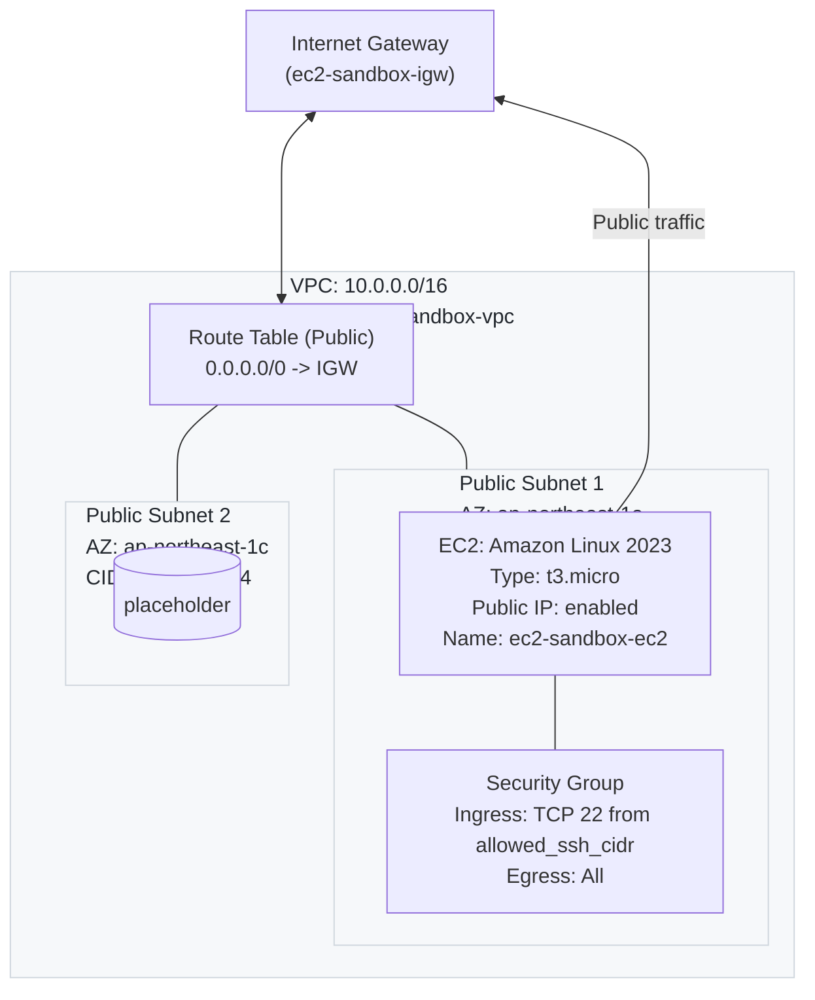

# EC2 Sandbox (ap-northeast-1)

最小構成で EC2 を 1 台起動する Terraform スタックです。VPC / Public Subnet(2AZ) / IGW / ルート / SG を作成し、Public Subnet に Amazon Linux 2（yum）の EC2 を配置します。

## 構成
- VPC: `10.0.0.0/16`
- Public Subnets: `10.0.0.0/24` (1a), `10.0.1.0/24` (1c)
- Internet Gateway + 0.0.0.0/0 ルート
- SG: SSH(22) を `var.allowed_ssh_cidr` のみ許可、Outbound 全許可
- EC2: `t3.micro` / Amazon Linux 2 / Public IP 付与

## 変数 (一部抜粋)
- `region` (既定: `ap-northeast-1`)
- `project_name` (既定: `ec2-sandbox`)
- `allowed_ssh_cidr` (既定: `0.0.0.0/0` → ご自身のIP/32推奨)
- `key_name` (既存 Key Pair 名。省略可)

## 使い方
```bash
cd aws_infrastructure01/sandbox

# 初期化
terraform init

# 計画 (SSH 許可元を自IPへ変更する例)
terraform plan -var "allowed_ssh_cidr=$(curl -s ifconfig.me)/32" -var "key_name=YOUR_KEYPAIR_NAME"

# 作成
terraform apply -auto-approve \
  -var "allowed_ssh_cidr=$(curl -s ifconfig.me)/32" \
  -var "key_name=YOUR_KEYPAIR_NAME"

# 出力
terraform output
```

Windows PowerShell の例 (自IP検出が不要なら手入力推奨):
```powershell
cd aws_infrastructure01/sandbox
terraform init
$myip = (Invoke-RestMethod -Uri "https://ifconfig.me").Trim()
terraform plan -var "allowed_ssh_cidr=$myip/32" -var "key_name=YOUR_KEYPAIR_NAME"
terraform apply -auto-approve -var "allowed_ssh_cidr=$myip/32" -var "key_name=YOUR_KEYPAIR_NAME"
```

## SSH 接続例
```bash
ssh -i /path/to/your.pem ec2-user@$(terraform output -raw instance_public_ip)
```

## 片付け
```bash
terraform destroy
```

> コスト最小化のため NAT Gateway は含めていません。必要になれば private subnet と合わせて拡張可能です。

## 構成図
以下は本スタックの構成図です。VS Code の Markdown プレビュー（Ctrl+Shift+V）と「Markdown Preview Mermaid Support」拡張で表示されます。


